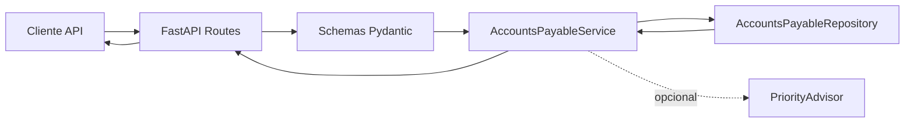

# ProjetoLaboratorio

Micro-API REST para o domínio de contas a pagar, construída como MVP para validar o fluxo operacional mínimo de cadastro, consulta, atualização, cancelamento e registro de pagamento.

O projeto também inclui um componente de prioridade assistida por IA, com heurística local e fallback seguro para chamada externa, preparado para evolução futura no fluxo principal.

## Objetivo do MVP

O MVP busca entregar uma base simples e consistente para o processo interno de contas a pagar, reduzindo controles manuais dispersos e expondo operações por HTTP/JSON.

No backlog atual, o foco está em:

- cadastro de conta a pagar;
- consulta por identificador e listagem;
- atualização de dados permitidos;
- cancelamento de conta;
- registro de pagamento;
- tratamento padronizado de respostas e erros.

## Stack

- Python 3.12+
- FastAPI
- Pydantic
- Uvicorn
- Pytest para testes automatizados

## Estrutura do projeto

```text
app/
  api/
    accounts_payable_routes.py
    responses.py
  models/
    accounts_payable.py
  repositories/
    accounts_payable_repository.py
  services/
    accounts_payable_service.py
    priority_advisor.py
  main.py
tests/
  test_accounts_payable_routes.py
  test_accounts_payable_service.py
  test_priority_advisor.py
docs/
  escopo-mvp.md
  backlog.md
  diagrama-componentes.md
```

## Instalação

As dependências do projeto estão centralizadas em `requirements.txt`.

### 1. Criar e ativar ambiente virtual

No Windows PowerShell:

```bash
py -3 -m venv .venv
.venv\Scripts\Activate.ps1
```

### 2. Instalar dependências

```bash
py -3 -m pip install -r requirements.txt
```

Se quiser habilitar o componente de prioridade com chamada externa, configure também a credencial da API usada pelo `PriorityAdvisor`.

## Configuração

O projeto espera variáveis de ambiente definidas em `.env.example`:

```env
APP_NAME=Micro-API de Contas a Pagar
APP_VERSION=0.1.0
API_PREFIX=
APP_HOST=127.0.0.1
APP_PORT=8000
```

Variáveis adicionais para o componente de IA:

```env
OPENAI_API_KEY=
OPENAI_MODEL=gpt-4o-mini
```

## Execução

Suba a API com:

```bash
py -3 -m uvicorn app.main:app --reload
```

Documentação interativa:

- Swagger UI: `http://127.0.0.1:8000/docs`
- OpenAPI JSON: `http://127.0.0.1:8000/openapi.json`

Health check:

- `GET /`

## Endpoints principais

Base atual: `/accounts-payable`

- `POST /accounts-payable`: cria uma conta
- `GET /accounts-payable`: lista contas
- `GET /accounts-payable/{id}`: consulta uma conta por identificador
- `PUT /accounts-payable/{id}`: atualiza dados permitidos
- `POST /accounts-payable/{id}/payment`: registra pagamento
- `PATCH /accounts-payable/{id}/status`: altera status permitido
- `POST /accounts-payable/{id}/cancel`: cancela a conta
- `GET /accounts-payable/overdue`: lista contas vencidas
- `DELETE /accounts-payable/{id}`: bloqueado por regra de rastreabilidade

## Modelo de domínio

Campos principais da conta a pagar:

- `descricao`
- `fornecedor_ou_favorecido`
- `categoria`
- `valor_previsto`
- `data_vencimento`
- `centro_de_custo`
- `data_emissao`
- `observacoes`
- `status`

Campos de liquidação:

- `data_pagamento`
- `valor_pago`
- `observacao_pagamento`

Status suportados:

- `pending`
- `paid`
- `overdue`
- `cancelled`

## Arquitetura

O projeto segue uma separação simples por camadas:

- `api`: rotas FastAPI e contrato HTTP
- `models`: schemas e validações com Pydantic
- `services`: regras de negócio
- `repositories`: armazenamento em memória para o fluxo atual do MVP

Fluxo resumido:



## Uso de IA

O componente `PriorityAdvisor` foi implementado para sugerir prioridade com duas camadas:

1. heurística local, sem custo externo;
2. chamada remota opcional para API de IA, com fallback automático para a heurística local em caso de falha.

Hoje ele:

- classifica prioridades como `low`, `medium`, `high` e `critical`;
- considera vencimento, palavras-chave e status;
- retorna fallback seguro quando a chamada externa falha.

Importante: no estado atual do projeto, o `PriorityAdvisor` existe como componente testado e preparado, mas não está integrado ao fluxo principal de criação/atualização da conta a pagar.

## Regras de negócio já implementadas

- `valor_previsto` deve ser maior que zero
- `data_vencimento` é obrigatória
- `descricao`, `fornecedor_ou_favorecido` e `categoria` são obrigatórios
- conta cancelada não pode ser atualizada nem paga
- conta paga não pode ser atualizada nem alterada de status
- `valor_pago` deve ser igual a `valor_previsto` para liquidar a conta
- `data_pagamento` não pode estar no futuro
- `data_pagamento` não pode ser anterior a `data_emissao`
- remoção física é bloqueada para preservar rastreabilidade mínima
- contas vencidas têm sincronização automática de status

## Testes

Há suítes de teste para:

- serviço de contas a pagar;
- rotas FastAPI com `TestClient`;
- componente `PriorityAdvisor`.

Executar todos os testes:

```bash
py -3 -m pytest tests
```

Executar um arquivo específico:

```bash
py -3 -m pytest tests/test_accounts_payable_service.py
py -3 -m pytest tests/test_priority_advisor.py
py -3 -m pytest tests/test_accounts_payable_routes.py
```

Observação: há um teste marcado como `xfail` no fluxo de remoção, porque a API atualmente bloqueia `DELETE` para preservar rastreabilidade.

## Limitações atuais

Estado atual do MVP ainda possui limitações importantes:

- ausência de autenticação nos endpoints;
- listagem ainda sem filtros, paginação e ordenação do backlog;
- documentação técnica ainda concentrada no README e no OpenAPI gerado;
- componente de prioridade por IA ainda não conectado ao fluxo principal da API.

## Próximos passos

- habilitar autenticação interna simples;
- adicionar filtros, paginação e ordenação;
- integrar a prioridade assistida por IA ao fluxo principal de negócio;
- ampliar cobertura de testes e pipeline de validação;
- consolidar documentação funcional e técnica da release final.

## Documentos de apoio

- `docs/escopo-mvp.md`
- `docs/backlog.md`
- `docs/diagrama-componentes.md`

## Status do projeto

O projeto já cobre boa parte do fluxo core da micro-API, mas ainda não representa o MVP final completo descrito no backlog. O README reflete o estado atual do código versionado, não a visão futura completa do escopo.
