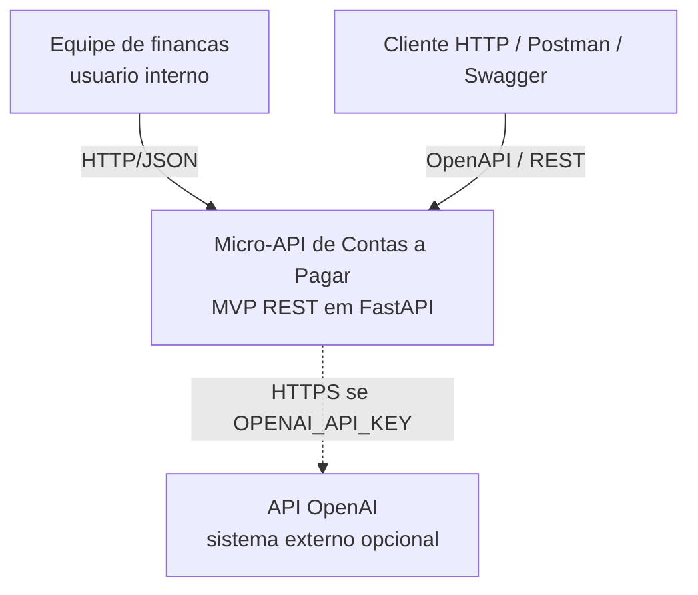
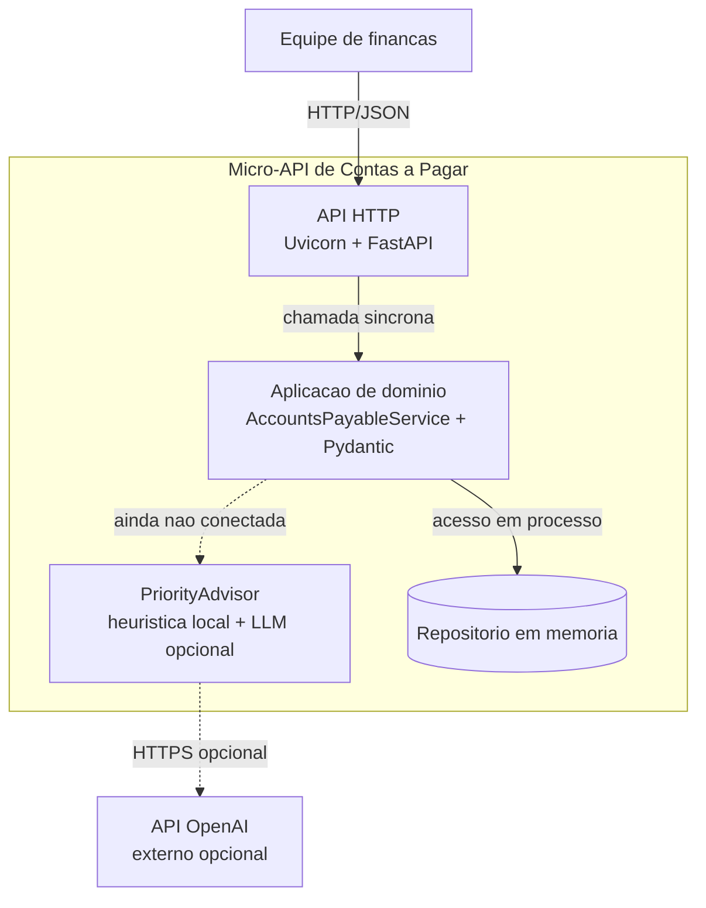
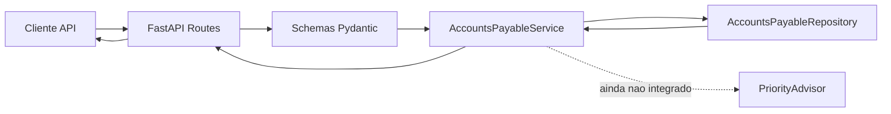
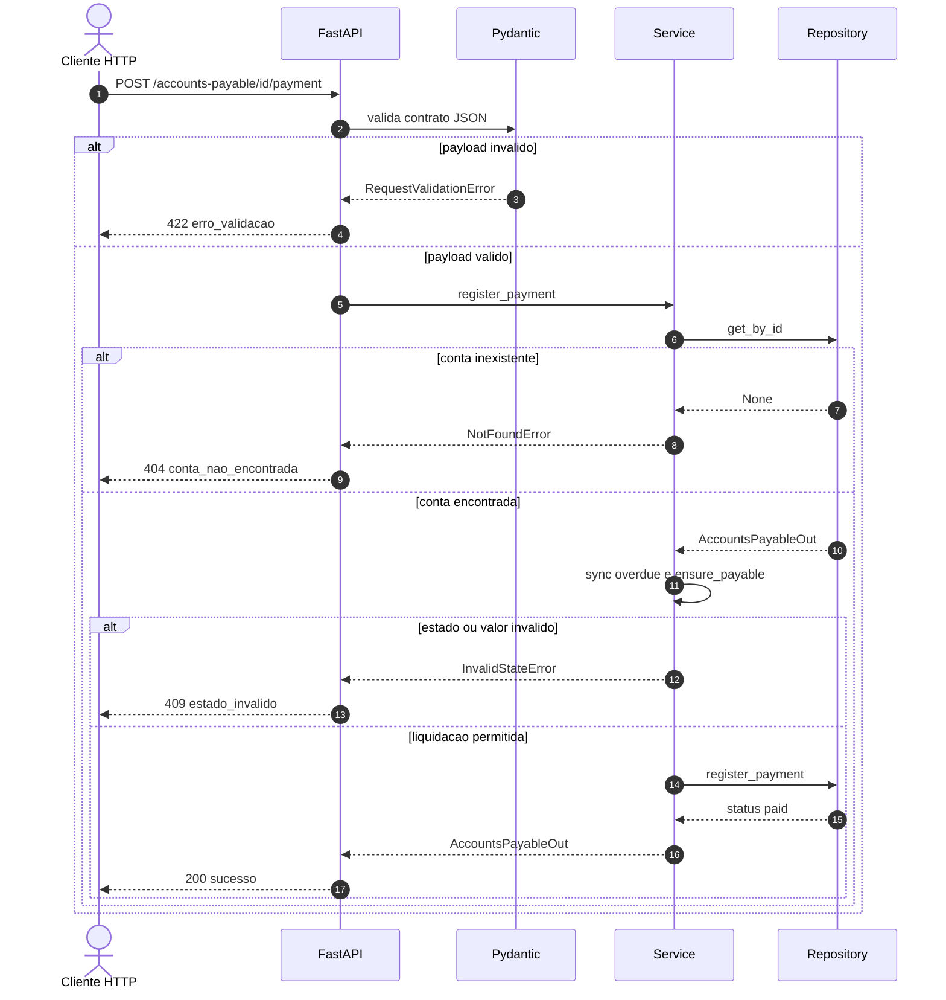
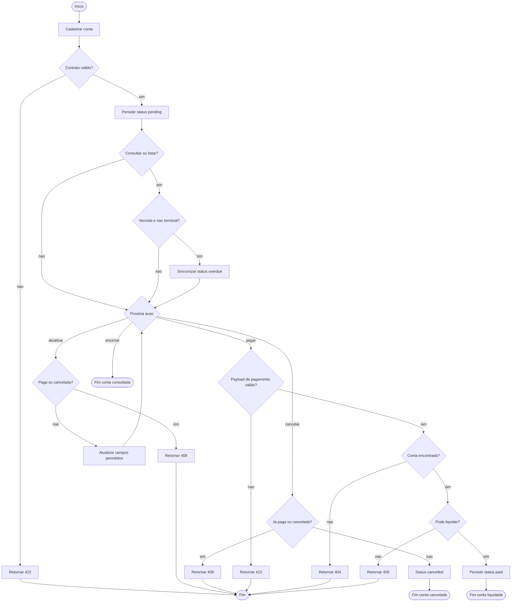

# ProjetoLaboratorio

Micro-API REST para o domínio de contas a pagar, construída como MVP para validar o fluxo operacional mínimo de cadastro, consulta, atualização, cancelamento e registro de pagamento.

O projeto também inclui um componente de prioridade assistida por IA, com heurística local e fallback seguro para chamada externa, preparado para evolução futura no fluxo principal.

## Objetivo do MVP

O MVP busca entregar uma base simples e consistente para o processo interno de contas a pagar, reduzindo controles manuais dispersos e expondo operações por HTTP/JSON.

No backlog atual, o foco está em:

- cadastro de conta a pagar;
- consulta por identificador e listagem;
- atualização de dados permitidos;
- cancelamento de conta;
- registro de pagamento;
- tratamento padronizado de respostas e erros.

## Stack

- Python 3.12+
- FastAPI
- Pydantic
- Uvicorn
- Pytest para testes automatizados
- Makefile com comandos de apoio

## Estrutura do projeto

```text
app/
  api/
    accounts_payable_routes.py
    responses.py
  models/
    accounts_payable.py
  repositories/
    accounts_payable_repository.py
  services/
    accounts_payable_service.py
    priority_advisor.py
  main.py
tests/
  test_accounts_payable_routes.py
  test_accounts_payable_service.py
  test_priority_advisor.py
docs/
  escopo-mvp.md
  backlog.md
  diagrama-componentes.md
  adr/
    README.md
    0001-micro-api-rest-fastapi.md
    0002-arquitetura-em-camadas.md
    0003-persistencia-em-memoria.md
    0004-bloqueio-remocao-fisica.md
    0005-envelope-padrao-http.md
    0006-priority-advisor-desacoplado.md
    0007-sincronizacao-overdue-na-leitura.md
    0008-autenticacao-adiada.md
```

## Instalação

As dependências do projeto estão centralizadas em `requirements.txt`.

Pré-requisitos:

- Python 3.12 ou superior
- `pip` disponível no Python 3
- `make` opcional, caso queira usar os atalhos do `Makefile`

### 1. Criar e ativar ambiente virtual

No Windows PowerShell:

```bash
py -3 -m venv .venv
.venv\Scripts\Activate.ps1
```

No Linux/macOS:

```bash
python3 -m venv .venv
source .venv/bin/activate
```

### 2. Instalar dependências

```bash
py -3 -m pip install -r requirements.txt
```

Ou com `Makefile`:

```bash
make install
```

Se quiser habilitar o componente de prioridade com chamada externa, configure também a credencial da API usada pelo `PriorityAdvisor`.

## Configuração

O projeto espera variáveis de ambiente definidas em `.env.example`:

Crie um arquivo local a partir do exemplo:

```bash
copy .env.example .env
```

No Linux/macOS:

```bash
cp .env.example .env
```

```env
APP_NAME=Micro-API de Contas a Pagar
APP_VERSION=0.1.0
API_PREFIX=
APP_HOST=127.0.0.1
APP_PORT=8000
```

Variáveis adicionais para o componente de IA:

```env
OPENAI_API_KEY=
OPENAI_MODEL=gpt-4o-mini
```

Resumo das variáveis:

- `APP_NAME`, `APP_VERSION`, `API_PREFIX`, `APP_HOST` e `APP_PORT`: configuração da API
- `OPENAI_API_KEY`: habilita a tentativa de chamada remota do componente de IA
- `OPENAI_MODEL`: define o modelo usado nessa chamada opcional

Se `OPENAI_API_KEY` não for informada, o projeto continua funcionando normalmente e o `PriorityAdvisor` usa apenas a heurística local.

## Execução

Suba a API com:

```bash
py -3 -m uvicorn app.main:app --reload
```

Ou com `Makefile`:

```bash
make run
```

Documentação interativa:

- Swagger UI: `http://127.0.0.1:8000/docs`
- OpenAPI JSON: `http://127.0.0.1:8000/openapi.json`

Health check:

- `GET /`

Verificação rápida após subir a API:

```bash
curl http://127.0.0.1:8000/
```

## Endpoints principais

Base atual: `/accounts-payable`

- `POST /accounts-payable`: cria uma conta
- `GET /accounts-payable`: lista contas
- `GET /accounts-payable/{id}`: consulta uma conta por identificador
- `PUT /accounts-payable/{id}`: atualiza dados permitidos
- `POST /accounts-payable/{id}/payment`: registra pagamento
- `PATCH /accounts-payable/{id}/status`: altera status permitido
- `POST /accounts-payable/{id}/cancel`: cancela a conta
- `GET /accounts-payable/overdue`: lista contas vencidas
- `DELETE /accounts-payable/{id}`: bloqueado por regra de rastreabilidade

Exemplo de criação:

```json
{
  "descricao": "Pagamento de licenca SaaS",
  "fornecedor_ou_favorecido": "Fornecedor Cloud",
  "categoria": "Software",
  "valor_previsto": "299.90",
  "data_vencimento": "2026-05-05",
  "data_emissao": "2026-04-27",
  "centro_de_custo": "TI",
  "observacoes": "Assinatura anual parcelada"
}
```

Exemplo de resposta:

```json
{
  "sucesso": true,
  "mensagem": "Conta a pagar criada com sucesso.",
  "dados": {
    "id": "uuid",
    "descricao": "Pagamento de licenca SaaS",
    "status": "pending"
  }
}
```

## Modelo de domínio

Campos principais da conta a pagar:

Obrigatórios:

- `descricao`
- `fornecedor_ou_favorecido`
- `categoria`
- `valor_previsto`
- `data_vencimento`

Opcionais:

- `centro_de_custo`
- `data_emissao`
- `observacoes`

Calculados e de controle:

- `status`

Campos de liquidação:

- `data_pagamento`
- `valor_pago`
- `observacao_pagamento`

Status suportados:

- `pending`
- `paid`
- `overdue`
- `cancelled`

## Arquitetura

O projeto segue uma separação simples por camadas:

- `api`: rotas FastAPI e contrato HTTP
- `models`: schemas e validações com Pydantic
- `services`: regras de negócio
- `repositories`: armazenamento em memória para o fluxo atual do MVP

Arquivos principais:

- `app/main.py`: bootstrap da aplicação e handlers globais de erro
- `app/api/accounts_payable_routes.py`: endpoints HTTP do domínio
- `app/models/accounts_payable.py`: modelos e validações de entrada/saída
- `app/services/accounts_payable_service.py`: regras de negócio e orquestração
- `app/repositories/accounts_payable_repository.py`: armazenamento em memória
- `app/services/priority_advisor.py`: heurística local e chamada opcional de IA

Os diagramas abaixo estão em Mermaid (`flowchart` e `sequenceDiagram`), que o GitHub renderiza no README. A visão estrutural é inspirada no C4 (contexto e containers), mas usa `flowchart` porque o renderer do GitHub não desenha `C4Context`/`C4Container` e o preview fica em carregamento. A cópia de apoio fica em `docs/diagrama-componentes.md`. As decisões que sustentam esse desenho estão em `docs/adr/`.

### Diagrama estrutural — contexto do sistema (C4 Nível 1)

Descrição: a equipe de finanças (ou um sistema interno) consome a micro-API por HTTP/JSON para operar o ciclo mínimo de contas a pagar. O `PriorityAdvisor` existe no repositório, mas ainda não participa das rotas. Quando `OPENAI_API_KEY` estiver configurada, ele pode consultar a API da OpenAI, com fallback local.


```mermaid
flowchart TB
    financeiro["Equipe de financas<br/>usuario interno"]
    cliente["Cliente HTTP / Postman / Swagger"]
    api["Micro-API de Contas a Pagar<br/>MVP REST em FastAPI"]
    openai["API OpenAI<br/>sistema externo opcional"]

    financeiro -->|"HTTP/JSON"| api
    cliente -->|"OpenAPI / REST"| api
    api -.->|"HTTPS se OPENAI_API_KEY"| openai
```

### Diagrama estrutural — visão de containers (C4 Nível 2)

Descrição: um único processo Python (Uvicorn + FastAPI) concentra a API. A camada de aplicação aplica as regras de domínio. A persistência do MVP é um dicionário em memória, sem banco externo. O `PriorityAdvisor` é um container lógico preparado, ainda desconectado das rotas.


```mermaid
flowchart TB
    financeiro["Equipe de financas"]

    subgraph sistema["Micro-API de Contas a Pagar"]
        web["API HTTP<br/>Uvicorn + FastAPI"]
        app["Aplicacao de dominio<br/>AccountsPayableService + Pydantic"]
        advisor["PriorityAdvisor<br/>heuristica local + LLM opcional"]
        store[("Repositorio em memoria")]
    end

    openai["API OpenAI<br/>externo opcional"]

    financeiro -->|"HTTP/JSON"| web
    web -->|"chamada sincrona"| app
    app -->|"acesso em processo"| store
    app -.->|"ainda nao conectada"| advisor
    advisor -.->|"HTTPS opcional"| openai
```

### Diagrama estrutural — componentes internos

Descrição: detalha o caminho real da requisição dentro do processo. A rota valida o contrato com Pydantic, o serviço aplica regras e o repositório grava em memória. O advisor permanece fora do caminho feliz atual.


```mermaid
flowchart LR
    Client["Cliente API"]
    Routes["FastAPI Routes"]
    Schemas["Schemas Pydantic"]
    Service["AccountsPayableService"]
    Advisor["PriorityAdvisor"]
    Repository["AccountsPayableRepository"]

    Client --> Routes
    Routes --> Schemas
    Schemas --> Service
    Service --> Repository
    Service -. ainda nao integrado .-> Advisor
    Repository --> Service
    Service --> Routes
    Routes --> Client
```

### Diagrama comportamental — jornada crítica de liquidação

Descrição: a jornada crítica do MVP é o registro de pagamento (`POST /accounts-payable/{id}/payment`). Ela fecha o ciclo operacional: a conta precisa existir, estar em estado pagável (`pending` ou `overdue`) e o `valor_pago` deve ser igual ao `valor_previsto`. Datas futuras e contas já pagas ou canceladas são rejeitadas.

Caminho feliz: payload válido → conta encontrada → regras de liquidação ok → status `paid` persistido → `200` com envelope de sucesso.

Desvios: `422` na validação do contrato; `404` se o identificador não existir; `409` se o estado ou o valor impedirem a liquidação.


```mermaid
sequenceDiagram
    autonumber
    actor Cliente as Cliente HTTP
    participant API as FastAPI
    participant Schema as Pydantic
    participant Svc as Service
    participant Repo as Repository

    Cliente->>API: POST /accounts-payable/id/payment
    API->>Schema: valida contrato JSON

    alt payload invalido
        Schema-->>API: RequestValidationError
        API-->>Cliente: 422 erro_validacao
    else payload valido
        API->>Svc: register_payment
        Svc->>Repo: get_by_id

        alt conta inexistente
            Repo-->>Svc: None
            Svc-->>API: NotFoundError
            API-->>Cliente: 404 conta_nao_encontrada
        else conta encontrada
            Repo-->>Svc: AccountsPayableOut
            Svc->>Svc: sync overdue e ensure_payable

            alt estado ou valor invalido
                Svc-->>API: InvalidStateError
                API-->>Cliente: 409 estado_invalido
            else liquidacao permitida
                Svc->>Repo: register_payment
                Repo-->>Svc: status paid
                Svc-->>API: AccountsPayableOut
                API-->>Cliente: 200 sucesso
            end
        end
    end
```

### Diagrama comportamental — atividades do ciclo operacional

Descrição: o diagrama de atividades mostra o fluxo de trabalho da conta a pagar, do cadastro até um estado terminal (`paid` ou `cancelled`). Consultas sincronizam vencidas automaticamente. Atualização e pagamento só seguem se a conta não estiver paga nem cancelada. A remoção física não aparece como caminho válido: a API bloqueia `DELETE` e exige cancelamento para preservar rastreabilidade.


```mermaid
flowchart TD
    startNode([Inicio]) --> cadastrar[Cadastrar conta]
    cadastrar --> validaCadastro{Contrato valido?}

    validaCadastro -->|nao| erro422[Retornar 422]
    erro422 --> fimErro([Fim])

    validaCadastro -->|sim| persistir[Persistir status pending]
    persistir --> consultar{Consultar ou listar?}

    consultar -->|sim| syncVencida{Vencida e nao terminal?}
    consultar -->|nao| decidirAcao
    syncVencida -->|sim| marcarOverdue[Sincronizar status overdue]
    syncVencida -->|nao| decidirAcao
    marcarOverdue --> decidirAcao{Proxima acao}

    decidirAcao -->|atualizar| podeAtualizar{Paga ou cancelada?}
    podeAtualizar -->|sim| erro409upd[Retornar 409]
    podeAtualizar -->|nao| atualizar[Atualizar campos permitidos]
    atualizar --> decidirAcao
    erro409upd --> fimErro

    decidirAcao -->|cancelar| podeCancelar{Ja paga ou cancelada?}
    podeCancelar -->|sim| erro409can[Retornar 409]
    podeCancelar -->|nao| cancelar[Status cancelled]
    cancelar --> fimCancelada([Fim conta cancelada])
    erro409can --> fimErro

    decidirAcao -->|pagar| validaPagto{Payload de pagamento valido?}
    validaPagto -->|nao| erro422pag[Retornar 422]
    erro422pag --> fimErro
    validaPagto -->|sim| existeConta{Conta encontrada?}
    existeConta -->|nao| erro404[Retornar 404]
    erro404 --> fimErro
    existeConta -->|sim| podePagar{Pode liquidar?}
    podePagar -->|nao| erro409pag[Retornar 409]
    erro409pag --> fimErro
    podePagar -->|sim| liquidar[Persistir status paid]
    liquidar --> fimPaga([Fim conta liquidada])

    decidirAcao -->|encerrar| fimConsulta([Fim conta consultada])
```

## Uso de IA

O componente `PriorityAdvisor` foi implementado para sugerir prioridade com duas camadas:

1. heurística local, sem custo externo;
2. chamada remota opcional para API de IA, com fallback automático para a heurística local em caso de falha.

Fluxo atual:

1. recebe `descricao`, `observacoes`, `data_vencimento` e `status`;
2. calcula uma prioridade local com base em prazo e palavras-chave;
3. se `OPENAI_API_KEY` estiver configurada, tenta uma chamada remota;
4. se a chamada falhar, mantém o resultado da heurística local.

Hoje ele:

- classifica prioridades como `low`, `medium`, `high` e `critical`;
- considera vencimento, palavras-chave e status;
- retorna fallback seguro quando a chamada externa falha.

Variáveis relacionadas:

- `OPENAI_API_KEY`
- `OPENAI_MODEL`

Exemplo de cenário:

- conta com vencimento próximo: tende a `high`
- conta vencida: tende a `critical`
- conta sem urgência explícita: tende a `low`

Importante:

- hoje o `PriorityAdvisor` existe como componente testado e preparado;
- ele ainda não participa do fluxo principal de criação ou atualização da conta a pagar;
- portanto, a IA está presente no projeto, mas ainda não é uma funcionalidade exposta na API atual.

## Regras de negócio já implementadas

- `valor_previsto` deve ser maior que zero
- `data_vencimento` é obrigatória
- `descricao`, `fornecedor_ou_favorecido` e `categoria` são obrigatórios
- conta cancelada não pode ser atualizada nem paga
- conta paga não pode ser atualizada nem alterada de status
- `valor_pago` deve ser igual a `valor_previsto` para liquidar a conta
- `data_pagamento` não pode estar no futuro
- `data_pagamento` não pode ser anterior a `data_emissao`
- remoção física é bloqueada para preservar rastreabilidade mínima
- contas vencidas têm sincronização automática de status

## Testes

Há suítes de teste para:

- serviço de contas a pagar;
- rotas FastAPI com `TestClient`;
- componente `PriorityAdvisor`.

Executar todos os testes:

```bash
py -3 -m pytest tests
```

Ou com `Makefile`:

```bash
make test
```

Executar um arquivo específico:

```bash
py -3 -m pytest tests/test_accounts_payable_service.py
py -3 -m pytest tests/test_priority_advisor.py
py -3 -m pytest tests/test_accounts_payable_routes.py
```

Observação: há um teste marcado como `xfail` no fluxo de remoção, porque a API atualmente bloqueia `DELETE` para preservar rastreabilidade.

Resultado esperado da suíte no estado atual:

- testes de serviço: passando
- testes do `PriorityAdvisor`: passando
- testes de rota: passando
- 1 caso `xfail` documentado para remoção física bloqueada

## Limitações atuais

Estado atual do MVP ainda possui limitações importantes:

- ausência de autenticação nos endpoints;
- listagem ainda sem filtros, paginação e ordenação do backlog;
- documentação técnica ainda concentrada no README e no OpenAPI gerado;
- componente de prioridade por IA ainda não conectado ao fluxo principal da API.

## Próximos passos

- habilitar autenticação interna simples;
- adicionar filtros, paginação e ordenação;
- integrar a prioridade assistida por IA ao fluxo principal de negócio;
- ampliar cobertura de testes e pipeline de validação;
- consolidar documentação funcional e técnica da release final.

## Decisões de arquitetura (ADR)

As escolhas vigentes do MVP estão registradas em `docs/adr/`. Cada ADR descreve contexto, decisão, alternativas e consequências.

| ID | Decisão |
|----|---------|
| [ADR-0001](docs/adr/0001-micro-api-rest-fastapi.md) | Micro-API REST com FastAPI |
| [ADR-0002](docs/adr/0002-arquitetura-em-camadas.md) | Arquitetura em camadas |
| [ADR-0003](docs/adr/0003-persistencia-em-memoria.md) | Persistência em memória |
| [ADR-0004](docs/adr/0004-bloqueio-remocao-fisica.md) | Bloqueio de remoção física |
| [ADR-0005](docs/adr/0005-envelope-padrao-http.md) | Envelope HTTP padronizado |
| [ADR-0006](docs/adr/0006-priority-advisor-desacoplado.md) | PriorityAdvisor desacoplado, com fallback |
| [ADR-0007](docs/adr/0007-sincronizacao-overdue-na-leitura.md) | Sincronização de vencidas na leitura |
| [ADR-0008](docs/adr/0008-autenticacao-adiada.md) | Autenticação adiada |

Índice: [`docs/adr/README.md`](docs/adr/README.md).

## Documentos de apoio

- `docs/escopo-mvp.md`
- `docs/backlog.md`
- `docs/diagrama-componentes.md`
- `docs/adr/README.md`

## Status do projeto

Já implementado:

- fluxo básico de cadastro, consulta, atualização, cancelamento e pagamento
- validações principais do domínio
- documentação OpenAPI via FastAPI
- suíte de testes para serviço, rotas e componente de IA
- utilitários de projeto como `Makefile`, `requirements.txt` e coleção Postman

Ainda pendente em relação ao backlog:

- autenticação interna simples
- filtros, paginação e ordenação
- integração efetiva da prioridade assistida por IA ao fluxo principal
- refinamento final da documentação para entrega

O README reflete o estado atual do código versionado, não uma visão futura já implementada.
