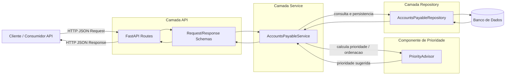

```mermaid
flowchart LR
    Client["Cliente / Consumidor API"]

    subgraph API["Camada API"]
        Routes["FastAPI Routes"]
        Schemas["Request/Response Schemas"]
    end

    subgraph Service["Camada Service"]
        AccountsService["AccountsPayableService"]
    end

    subgraph Advisor["Componente de Prioridade"]
        PriorityAdvisor["PriorityAdvisor"]
    end

    subgraph Repository["Camada Repository"]
        AccountsRepository["AccountsPayableRepository"]
    end

    DB[("Banco de Dados")]

    Client -->|"HTTP JSON Request"| Routes
    Routes --> Schemas
    Schemas --> AccountsService

    AccountsService -->|"calcula prioridade / ordenacao"| PriorityAdvisor
    PriorityAdvisor -->|"prioridade sugerida"| AccountsService

    AccountsService -->|"consulta e persistencia"| AccountsRepository
    AccountsRepository --> DB
    DB --> AccountsRepository

    AccountsRepository --> AccountsService
    AccountsService --> Schemas
    Schemas --> Routes
    Routes -->|"HTTP JSON Response"| Client
```
