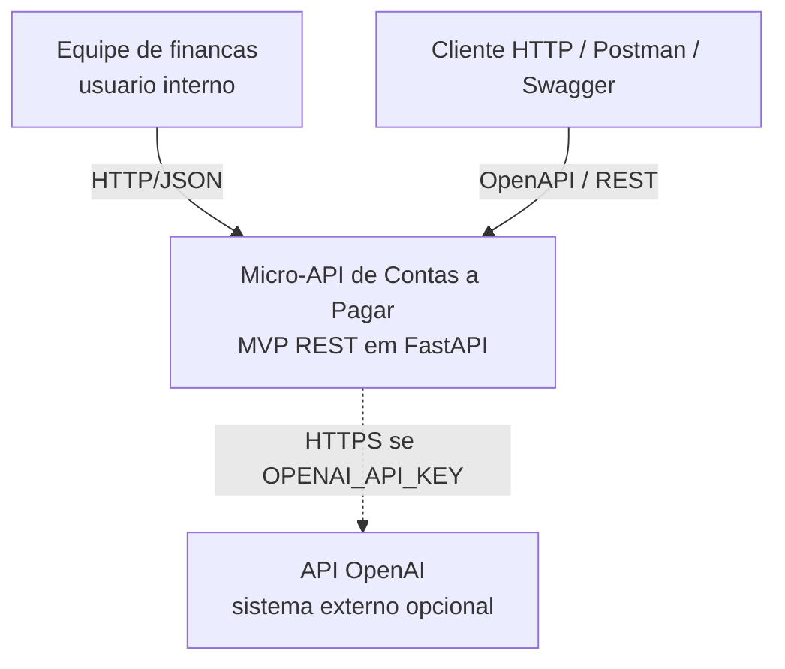
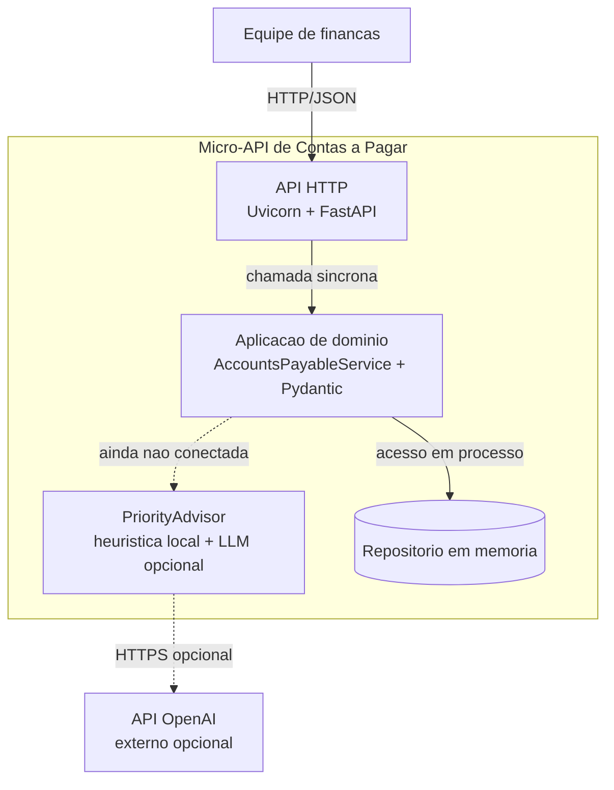
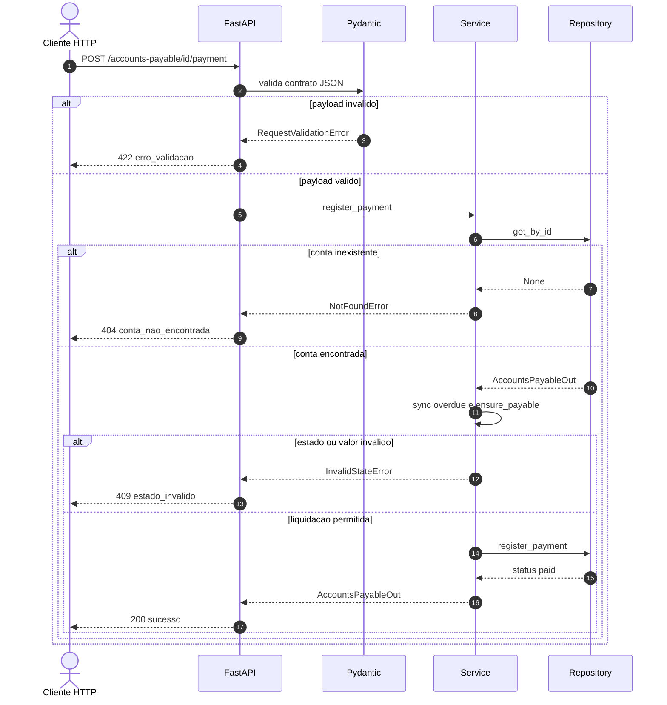
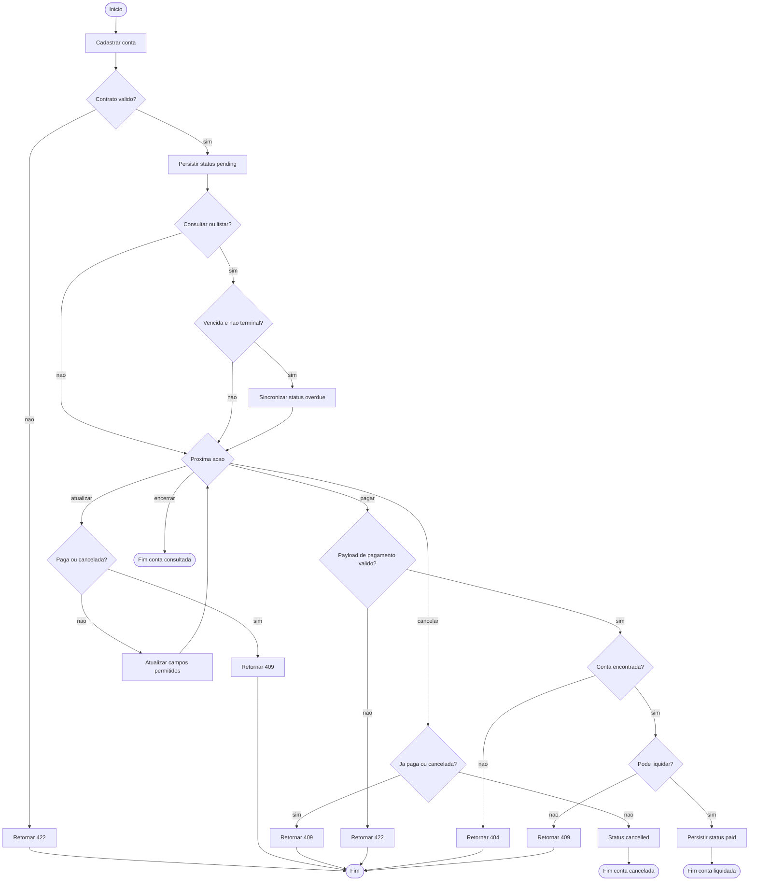

# Diagramas de arquitetura

Fonte canônica no README: seção **Arquitetura**.

Os blocos usam `flowchart` e `sequenceDiagram` para renderizar no GitHub. A visão estrutural é inspirada no C4, mas não usa `C4Context`/`C4Container`: o renderer do GitHub não desenha esses tipos e o preview fica em carregamento.

O desenho reflete o código versionado: persistência em memória, `PriorityAdvisor` preparado e ainda fora das rotas, e liquidação como jornada crítica.

## Contexto do sistema (C4 Nível 1)

A equipe de finanças consome a micro-API por HTTP/JSON. A OpenAI é um sistema externo opcional, usado apenas pelo componente de prioridade quando houver chave configurada.

## Visao de containers (C4 Nível 2)

Um processo Python concentra API, dominio e persistencia volatil. O advisor e um container logico ainda desconectado do fluxo principal.

## Componentes internos

## Jornada critica — registro de pagamento

`POST /accounts-payable/{id}/payment` fecha o ciclo operacional. Regras: conta existente, estado pagavel, `valor_pago` igual a `valor_previsto`, `data_pagamento` nao futura e nao anterior a emissao.

## Atividades do ciclo operacional

Fluxo de trabalho da conta, do cadastro ate um estado terminal (`paid` ou `cancelled`). Consultas sincronizam vencidas. Atualizacao e pagamento exigem conta nao paga e nao cancelada. `DELETE` nao e caminho valido: a API bloqueia remocao fisica.

