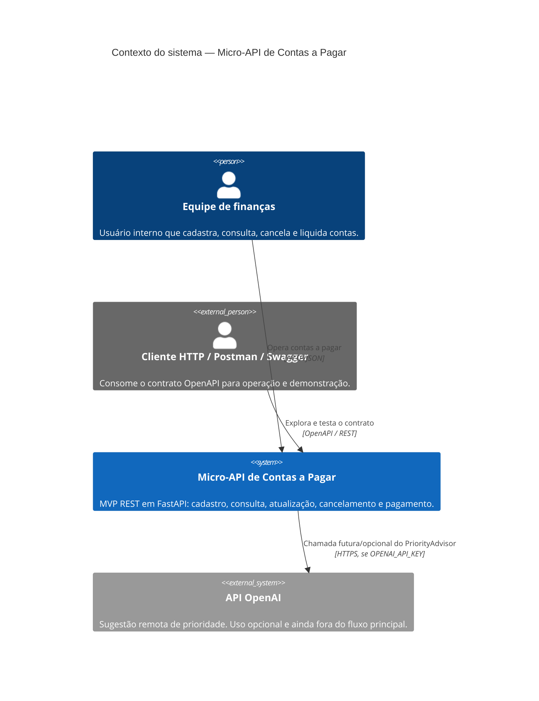
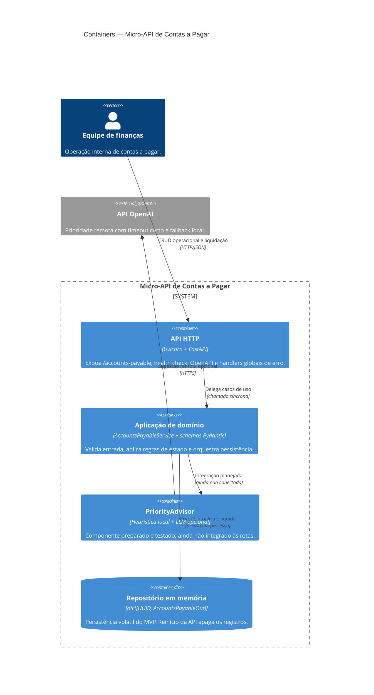
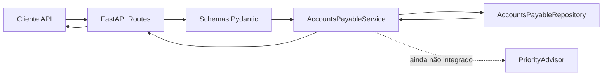
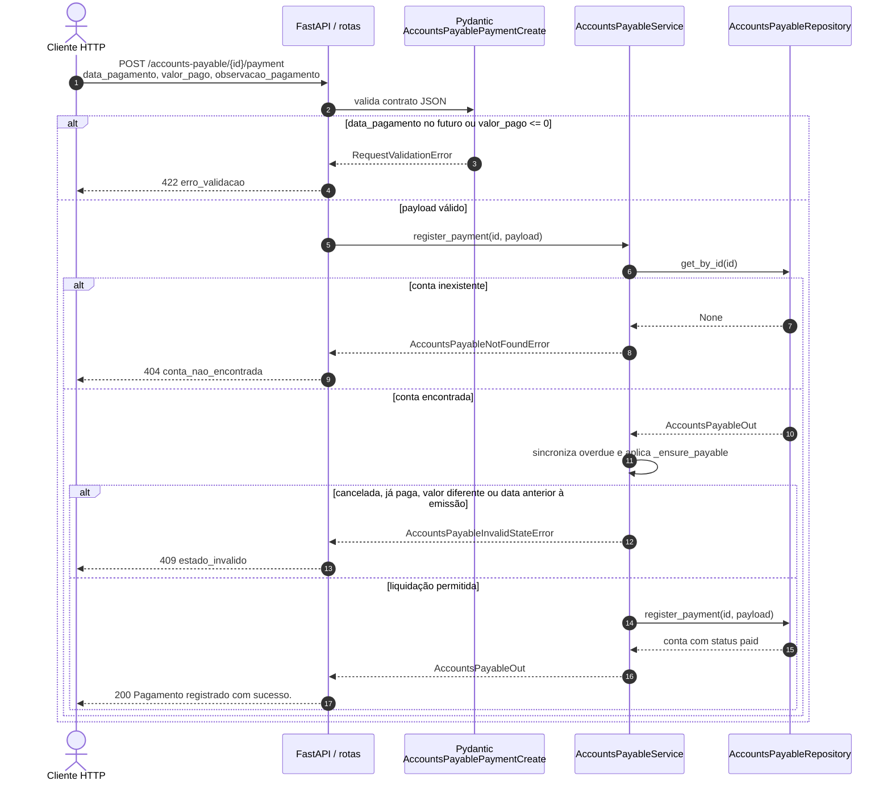
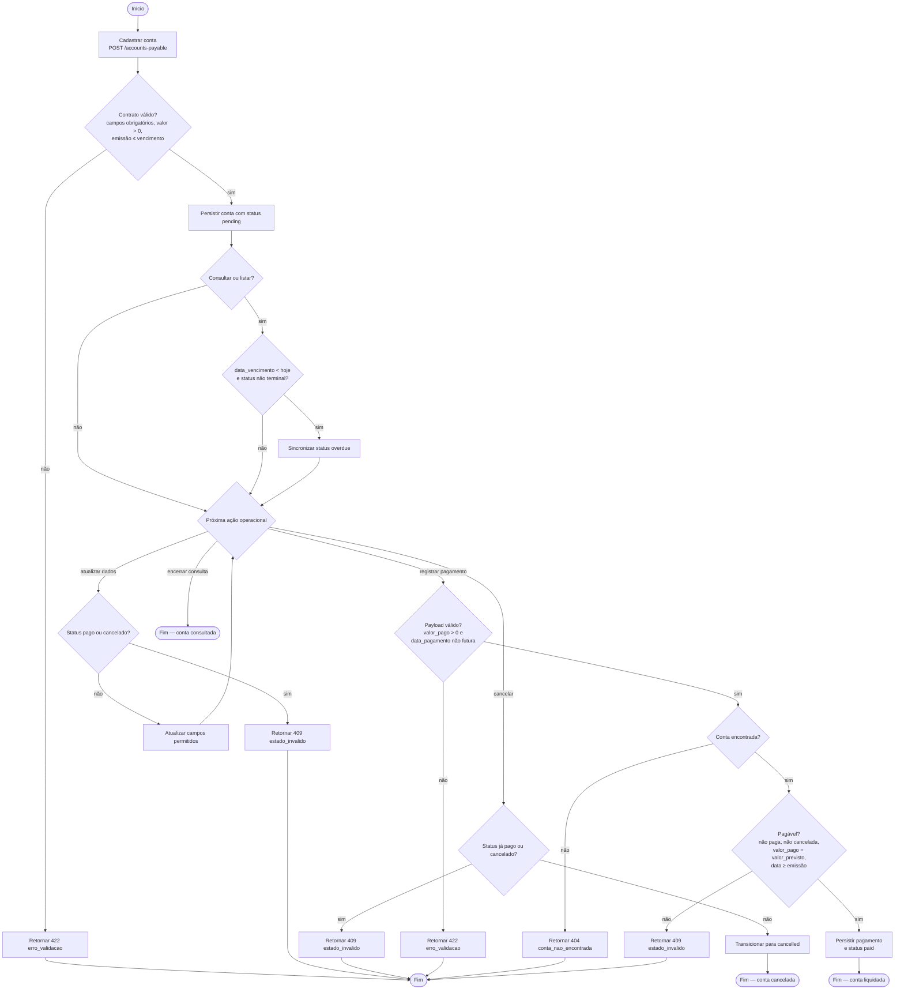

# Diagramas de arquitetura

Fonte canônica no README: seção **Arquitetura**. Os blocos Mermaid abaixo renderizam em visualizadores Markdown compatíveis (GitHub, GitLab, Cursor).

O desenho reflete o código versionado: persistência em memória, `PriorityAdvisor` preparado e ainda fora das rotas, e liquidação como jornada crítica.

## Contexto do sistema (C4 Nível 1)

A equipe de finanças consome a micro-API por HTTP/JSON. A OpenAI é um sistema externo opcional, usado apenas pelo componente de prioridade quando houver chave configurada.

## Visão de containers (C4 Nível 2)

Um processo Python concentra API, domínio e persistência volátil. O advisor é um container lógico ainda desconectado do fluxo principal.

## Componentes internos

## Jornada crítica — registro de pagamento

`POST /accounts-payable/{id}/payment` fecha o ciclo operacional. Regras: conta existente, estado pagável, `valor_pago` igual a `valor_previsto`, `data_pagamento` não futura e não anterior à emissão.

## Atividades do ciclo operacional

Fluxo de trabalho da conta, do cadastro até um estado terminal (`paid` ou `cancelled`). Consultas sincronizam vencidas. Atualização e pagamento exigem conta não paga e não cancelada. `DELETE` não é caminho válido: a API bloqueia remoção física.

