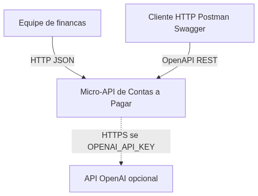
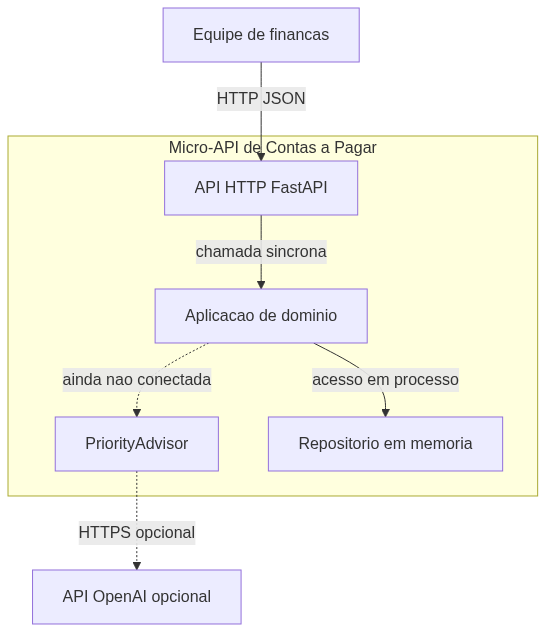
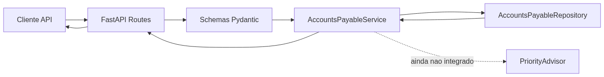
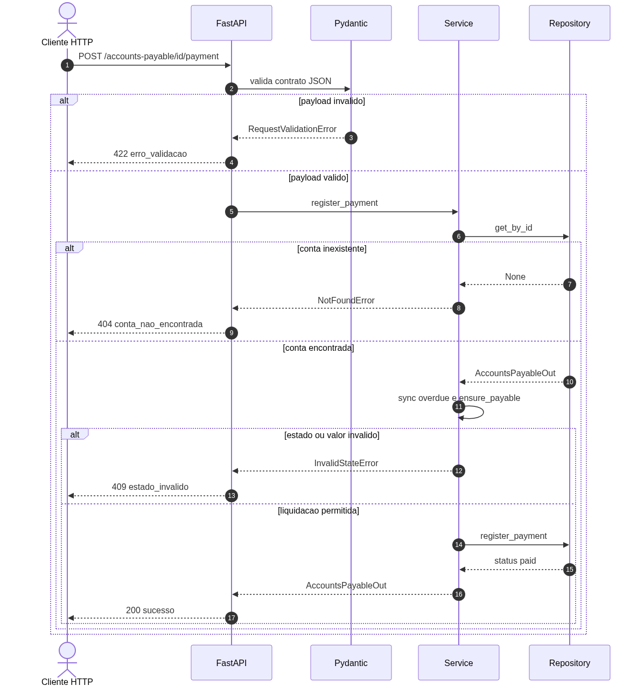
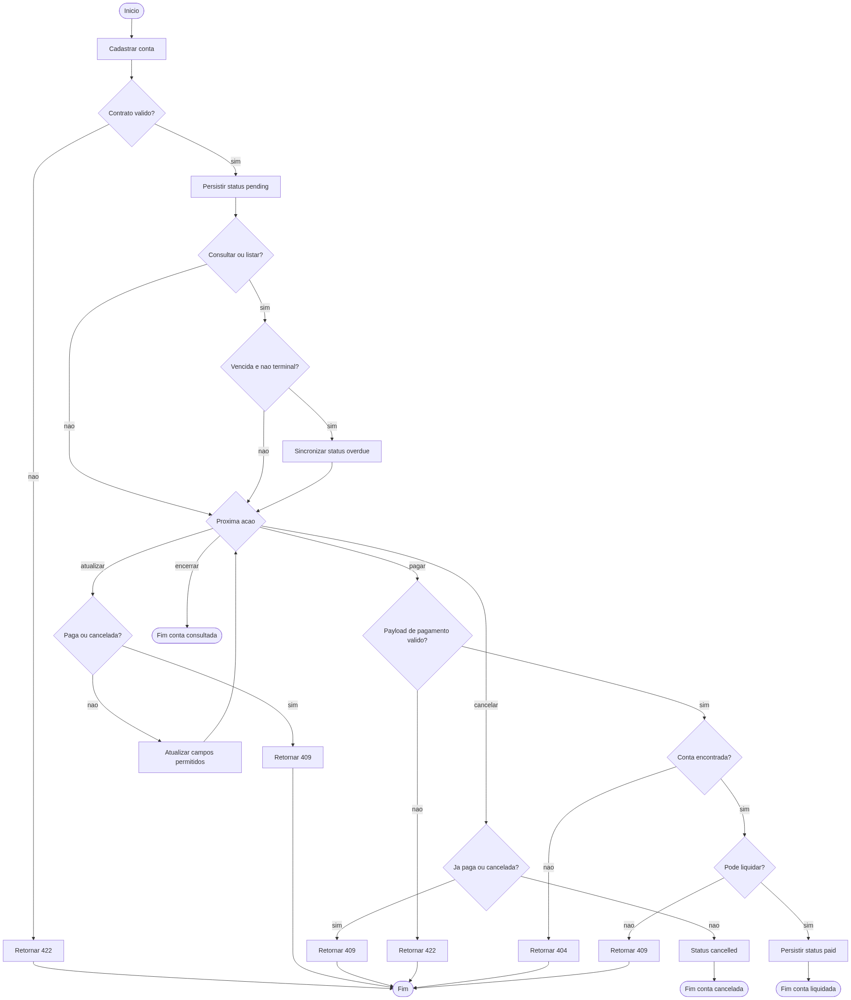

# Diagramas de arquitetura

Fonte canônica no README: seção **Arquitetura**.

O GitHub desta conta não renderiza blocos `mermaid` (erro "Unable to render rich display"). Por isso as figuras no README e neste arquivo são PNG gerados a partir dos `.mmd`.

Fonte editável: `docs/diagrams/*.mmd`.

## Contexto do sistema (C4 Nível 1)

A equipe de finanças consome a micro-API por HTTP/JSON. A OpenAI é um sistema externo opcional, usado apenas pelo componente de prioridade quando houver chave configurada.

Fonte: `diagrams/contexto.mmd`

## Visao de containers (C4 Nível 2)

Um processo Python concentra API, dominio e persistencia volatil. O advisor e um container logico ainda desconectado do fluxo principal.

Fonte: `diagrams/containers.mmd`

## Componentes internos

Fonte: `diagrams/componentes.mmd`

## Jornada critica — registro de pagamento

`POST /accounts-payable/{id}/payment` fecha o ciclo operacional. Regras: conta existente, estado pagavel, `valor_pago` igual a `valor_previsto`, `data_pagamento` nao futura e nao anterior a emissao.

Fonte: `diagrams/sequencia-pagamento.mmd`

## Atividades do ciclo operacional

Fluxo de trabalho da conta, do cadastro ate um estado terminal (`paid` ou `cancelled`). Consultas sincronizam vencidas. Atualizacao e pagamento exigem conta nao paga e nao cancelada. `DELETE` nao e caminho valido: a API bloqueia remocao fisica.

Fonte: `diagrams/atividades.mmd`
